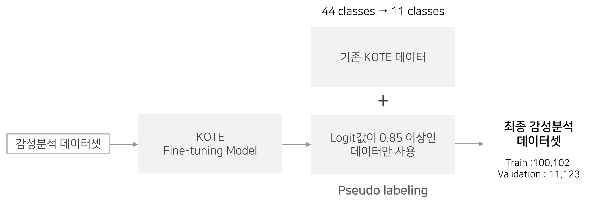

# 너하궁🌙 (너의 하루가 궁금해)

## 프로젝트 소개

### 기획 의도

<p align='center'></p>

‘너하궁’은 공감과 위로를 받고 싶은 순간, 일기장에 따뜻한 말 한마디를 적어 주시던 선생님처럼 누군가 내 하루의 이야기를 들어주고, 나의 감정에 공감해준다면 어떨까?라는 기획의도에서 시작되었습니다. 
그래서 저희 서비스는 사용자가 일기를 입력하면 감성을 분석하고, 일기의 내용을 공감해주는 코멘트를 출력하도록 구성되었습니다.

### 팀 소개


### 프로젝트 구조

```
.
|-- README.md
|-- code
|   |-- app
|   |   |-- backend
|   |   `-- frontend
|   |-- data_processing
|   |-- generation
|   |   |-- kobart
|   |   `-- kogpt
|   |-- prototype_page.py
|   `-- sentiment_analysis
|-- docs
|   |-- 감성분석_Human_evaluation_가이드라인.pdf
|   `-- 코멘트생성_Human_evaluation_가이드라인.pdf
`-- install
    |-- install_requirements.sh
    `-- requirements.txt
```

### 실행방법

**requirements 설치**

```bash
cd install
bash install_requirements.sh
```

**서비스**

```bash
# frontend
cd code/app/frontend
streamlit run mainpage.py --server.fileWatcherType none --server.port=30001

# backend
cd code/app/backend
python main.py

# prototype page
cd code
streamlit run prototype_page.py --server.fileWatcherType none --server.port=30001
```

### 데이터 소개

**비출판물 말뭉치 (ver 1.2) -** [모두의 말뭉치](https://corpus.korean.go.kr/request/reausetMain.do)

- 교정을 거치지 않았으며, 어디에도 공개되지 않은 개인적 글쓰기 자료로 구성
- 초등학생부터 80대 성인까지 총 5,937명의 자료
- 대분류가 ‘일기’인 데이터 수: 총 4,236개

**감성 대화 말뭉치 -** [AI Hub](https://aihub.or.kr/aihubdata/data/view.do?currMenu=115&topMenu=100&aihubDataSe=realm&dataSetSn=86)

- 사용자와 챗봇이 감성적인 상황에서 대화하는 데이터셋
- 정신건강을 위한 감성대화 서비스 필요에 의해 구축, 부정적인 감정이 많음 (60가지 감정 상태로 구분)
- 총 58,268개의 대화

## 프로젝트 과정

### 어노테이션 자동화

**감성분석 어노테이션 자동화**



- 기존 데이터 중 비출판물 말뭉치는 감정 어노테이션이 되어있지 않았고, 감성 대화 말뭉치는 서비스에서 제공하고자 하는 감정과 다르게 부정적인 감정이 많았음
- Pseudo-labeling 기법으로 감성분석 어노테이션 자동화를 진행

**코멘트 어노테이션 자동화**


- 미리 정제한 일기 데이터에 대한 코멘트 생성을 위해 GPT-3 기반의 text-davinci-003 모델 엔진을 사용
- 코멘트 생성 후 사람이 직접 검수를 하여 문법에 맞지 않거나 부자연스러운 부분을 고침

### 모델링 아키텍쳐

**코멘트 생성 아키텍처**


- 맞춤법 교정을 거친 일기 텍스트를 입력 받아서 일기 내용에 공감하는 코멘트를 출력
- 너무 유사한 문장을 반복하지 않도록, 생성 결과에서 유사 문장을 제거하는 후처리 과정을 거침
- 출력되는 코멘트가 안정적이면서도 다양한 표현을 사용할 수 있도록 beam search와 sampling 기법을 동시에 적용

**감성분석 아키텍쳐**

<p align='center'></p>

- 일기를 받아 일기에 맞는 감정을 생성
- 토큰화된 일기가 인코더를 거치고, 그 중 CLS 토큰 벡터를 사용하여 감정을 분류

### Human evaluation 가이드라인

**코멘트생성 Human evaluation 가이드라인** [[link]](https://github.com/boostcampaitech4lv23nlp1/final-project-level3-nlp-04/blob/9d706617e5fe503b55407883d58b9a5517f29972/docs/%EC%BD%94%EB%A9%98%ED%8A%B8%EC%83%9D%EC%84%B1_Human_evaluation_%EA%B0%80%EC%9D%B4%EB%93%9C%EB%9D%BC%EC%9D%B8.pdf)

- 기존 평가지표의 문제: 정답 문장과 생성 문장이 의미적으로 유사하다고 해서 사용자가 해당 코멘트에 반드시 만족한다고 볼 수는 없음
- 새로운 가이드라인 제시: 사용자의 입장에서 해당 코멘트가 만족스러운 코멘트인지도 평가해보기 위해 SSSA(Sensibleness and Specificity and Sympathy Average)라는 지표를 만들어 평가

**감성분석 Human evaluation 가이드라인** [[link]]

- 기존 평가지표의 문제: 각 감정 사이의 유사도를 반영하지 못함
- 새로운 가이드라인 제시: 사용자의 입장에서 느낀 감정과 모델이 분류한 감정의 일치도를 0에서 2까지 점수로 나타냄

### 서비스


- 사용자의 일기를 front에서 input으로 받아 fastapi로 넘겨주면, 모델에 값을 넘겨 예측한 감정과 생성된 코멘트를 output으로 받아옴
- 모델의 output을 string 값으로 front에 넘겨주면 서비스에 맞게 감정 label 네임을 변경해서 출력

## 프로젝트 결과

### 시연영상


